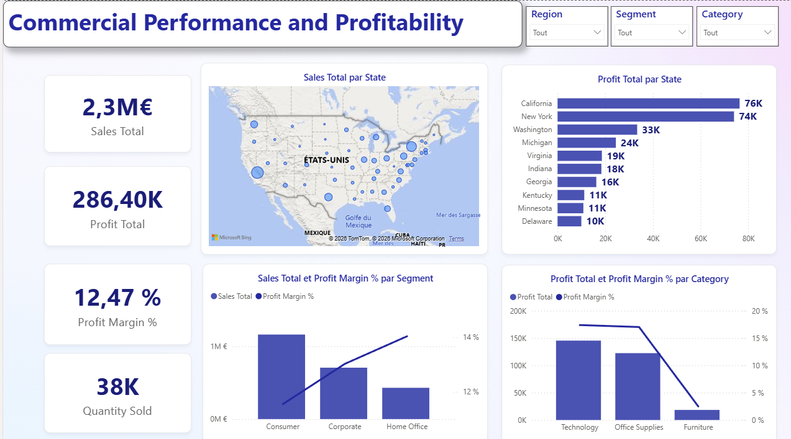

# Superstore Sales & Profitability Analysis

## Business Problem

The company wants to understand which customer segments, product categories, and regions generate the highest profitability in order to improve business performance and support decision-making.

## Tools Used

- Power BI
- Power Query
- DAX

## Dataset

Source:
https://www.kaggle.com/datasets/roopacalistus/superstore/data

## Key KPIs

- Sales Total: €2.3M
- Profit Total: €286.4K
- Profit Margin: 12.47%
- Quantity Sold: 38K

## Key Insights

- Consumer generates the highest sales volume but has the lowest profit margin.
- Home Office has the highest profit margin.
- Technology is the most profitable category.
- California and New York generate the highest profit.
- Some states generate negative profits and require further investigation.

## Dashboard

Dashboard screenshot available in this repository.

## Skills Demonstrated

- Data Cleaning
- Data Modeling
- DAX Measures
- Data Visualization
- Business Analysis
- Dashboard Design
